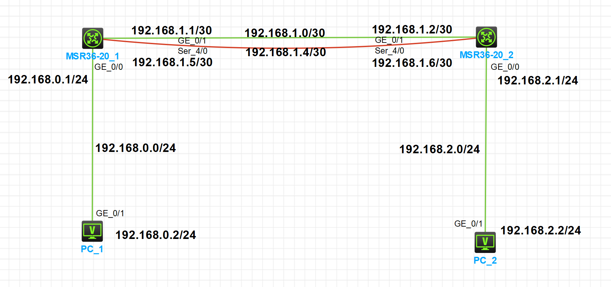
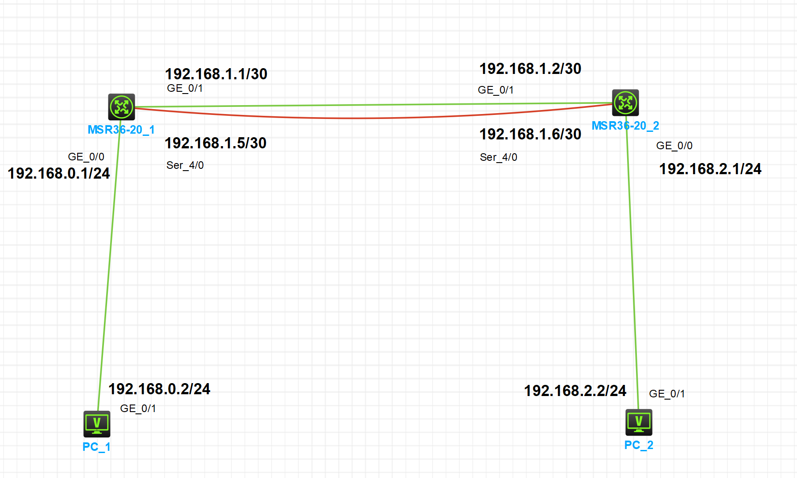
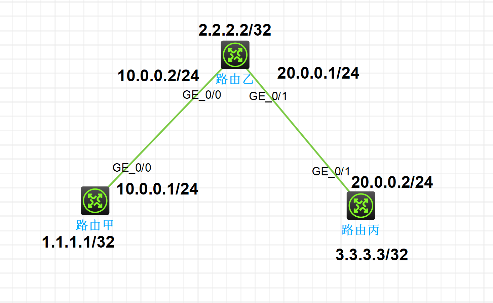
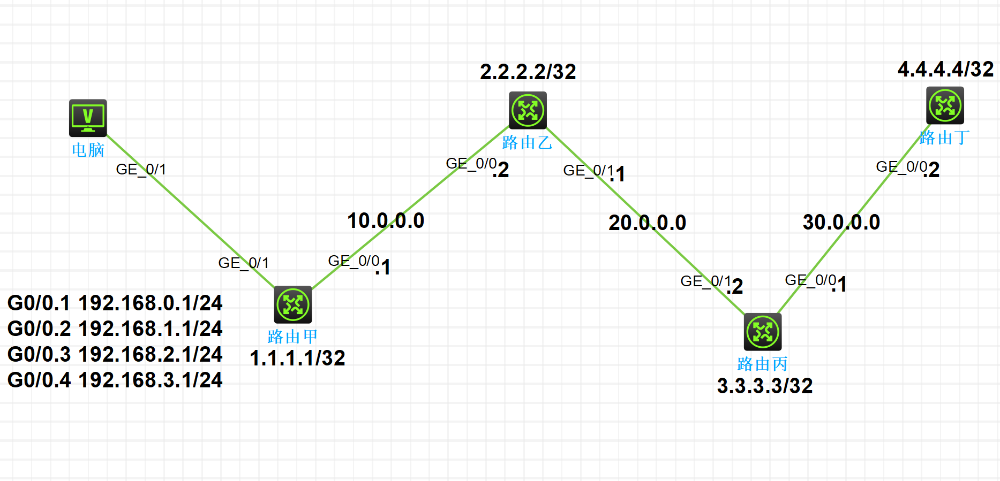
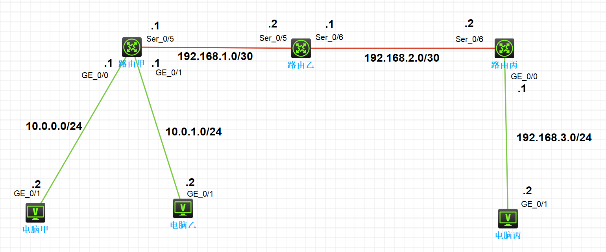
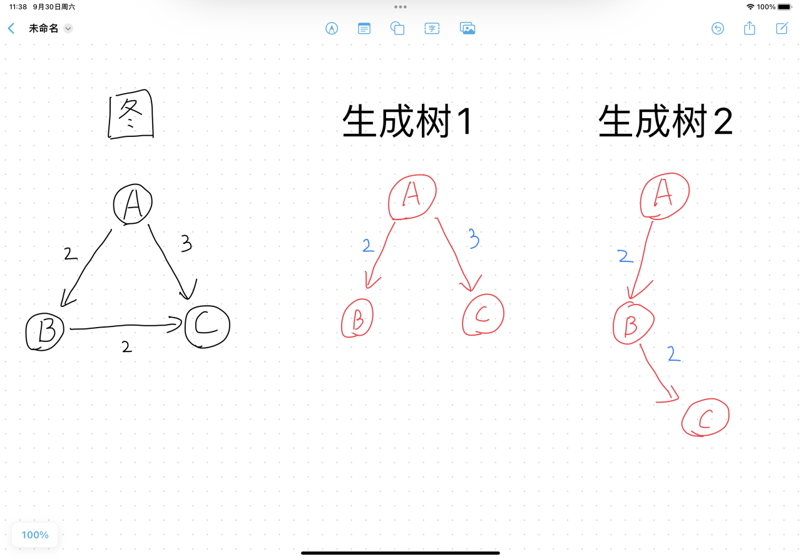
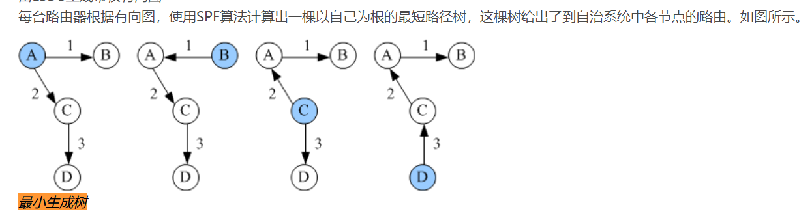
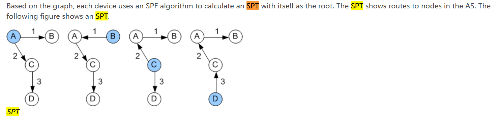
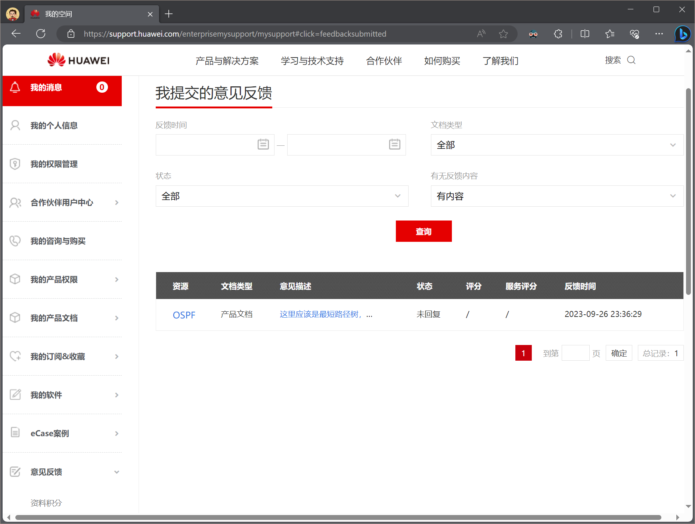

---
html:
    toc: true   # 打开侧边目录
export_on_save:
    html: true  # 自动保存
---

# 计算机网络

* [概述]()  
* 网络接口层
  * [物理层]()
  * [数据链路层]()
* 网际层
  * [网络层]() IPV4, IPV6
* 传输层
  * [运输层]() TCP, UDP
* 应用层
  * [会话层]() SMB, DNS
  * [表示层]() telnet, ftp
  * [应用层]() HTTP, DNS


## 网络层

### IPv4

IPv4地址通常分为网络地址和主机地址两部分，再加一个子网掩码。

* **网络地址** 用于标识特定网络
* **主机地址** 用于标识该网络上的特定设备。
* **子网掩码** 用于区分网络地址和主机地址

> 例如：`192.168.1.1 255.255.255.0`（`192.168.1.1/24`）
> 网络号为 `192.168.1.0`，主机号为 `1`
> 有效主机地址为 `192.168.1.1` ~ `192.168.1.254`
> 广播地址为 `192.168.1.255`

> Q：不太明白？
> A：假设有一个地址 `中国.四川.成都.金牛`，子网掩码为 `255.255.255.0`
> 网络号为 `中国.四川.成都.0`，主机号为 `金牛`，`金牛` 属于 $[1,254]$
> 有效主机地址为 `中国.四川.成都.1` ~ `中国.四川.成都.254`
> 广播地址为 `中国.四川.成都.255`

> Q：为什么要有子网掩码？
> * 节省IP地址
> * 实现网络的层次化
> * 路由器的路由表更小、转发速度更快
> * 广播范围更小

<br>

---

# 高级路由交换实验


**常用命令：**

* `display ip interface brief`：查看接口信息
* `display ip routing-table`：查看路由表
* `display fast-forward statistics`：查看快速转发表
* `display ospf peer`：查看 OSPF 邻居信息 

<br>

---

## 静态 ECMP

静态ECMP（Equal-CostMultipathRouting）是一种在网络环境中使用的等值多路径路由协议，可以同时使用多条链路，不仅增加了传输带宽，并且可以无时延无丢包地备份失效链路的数据传输。

**优点：**
- **负载均衡：** 平衡网络流量，提高资源利用率。
- **容错性：** 自动切换到可用路径，提高网络稳定性。
- **简单稳定：** 实现简单，稳定性高。
- **灵活性：** 适用于各种网络类型。

**缺点：**
- **不适用于动态网络：** 无法应对频繁网络变化。
- **可能不均衡：** 可能导致流量分布不均。
- **无法考虑路径质量：** 只考虑路径代价，不考虑质量。
- **不支持流量工程：** 无法根据流量需求调整路径。



**配置完成后，其中一个接口 `shutdown` 后，`PC_1` `PC_2` 仍然互相 `ping` 通。**


* 配置 `PC_1` `PC_2`

  ```
  如图所示
  ```

* 配置 `MSR36-20_1` 各个接口IP

  * `g0/0`
  ```shell
  # 进入接口配置模式
  [MSR36-20_1] interface g0/0 
  # 配置接口 IP 地址
  [MSR36-20_1-GigabitEthernet0/0] ip address 192.168.0.1 24
  # 退出接口 
  [MSR36-20_1-GigabitEthernet0/0] quit
  ```
  * `g0/1`   
  ```shell
  [MSR36-20_1] interface g0/1
  [MSR36-20_1-GigabitEthernet0/1] ip address 192.168.1.1 30
  [MSR36-20_1-GigabitEthernet0/1] quit
  ```
  * `s4/0`   
  ```shell
  [MSR36-20_1] interface s4/0
  [MSR36-20_1-Serial4/0] ip address 192.168.1.5 30
  [MSR36-20_1-Serial4/0] quit
  ```

* 配置 `MSR36-20_1` 静态路由

  ```shell
  # 进入静态路由配置模式
  # 目的网段：192.168.2.0/24，下一跳：192.168.1.2
  [MSR36-20_1] ip route-static 192.168.2.0 24 192.168.1.2
  [MSR36-20_1] ip route-static 192.168.2.0 24 192.168.1.6
  ```


* 配置 `MSR36-20_2` 各个接口 IP
* 配置 `MSR36-20_2` 静态路由

<br>

---

## 浮动静态路由

浮动静态路由是一种特殊类型的静态路由，它与普通的静态路由的主要区别在于具有备用路径，并且在主路径不可用时能够自动切换到备用路径。

**优点：**

- **自动容错：** 浮动静态路由可以自动检测主路径的状态，一旦主路径不可用，会自动切换到备用路径，提供快速的故障恢复和容错能力。

- **简化管理：** 相比动态路由协议，浮动静态路由的配置相对简单，不需要复杂的协议交互，降低了网络管理的复杂性。

- **灵活性：** 可以根据需要定义浮动条件和备用路径，使网络管理员可以根据具体需求进行定制，提供了较高的灵活性。

**缺点：**

- **不适用大规模网络：** 浮动静态路由适用于小规模网络，但在大规模网络中，配置和管理多个浮动静态路由可能变得复杂，不易扩展。

- **可能引入网络震荡：** 如果主备路径的状态在短时间内频繁切换，可能引入网络震荡，影响网络性能和稳定性。

- **手动配置：** 浮动静态路由需要手动配置主路径、备用路径和浮动条件，配置不当可能导致不符合实际需求，需要谨慎配置。




* 配置 `PC_1` `PC_2`
* 配置 `MSR36-20_1` `MSR36-20_2` 各个接口 IP

使用 RIP 协议作为 `MSR36-20_1` `MSR36-20_2` 之间的动态路由协议

* 配置 `MSR36-20_1` RIP
  
    ```shell
    # 进入路由协议配置模式
    [MSR36-20_1] rip
    # 广播网络信息（我可以到达这两个网络）
    [MSR36-20_1] network 192.168.0.0
    [MSR36-20_1] network 192.168.1.0
    # 设置 RIP 版本为 2
    [MSR36-20_1] version 2
    # 取消 RIP 摘要路由的配置
    [MSR36-20_1] undo summary
    # 在 s4/0 接口上设置静默状态（此接口不会主动发送 RIP 路由更新信息）
    [MSR36-20_1] silent-interface s4/0
    # 退出路由协议配置模式
    [MSR36-20_1] quit
    ```

* 配置 `MSR36-20_2` RIP

* 配置 `MSR36-20_1` 浮动静态路由

    ```shell
    # 目的地址：192.168.2.0/24，下一跳指向 s4/0 接口，优先级 120
    [MSR36-20_1] ip route-static 192.168.2.0 24 s4/0 preference 120
    ```

* 配置 `MSR36-20_2` 浮动静态路由

<br>

---

## OSPF 单区域配置




1. 配置 接口

2. 配置 OSPF
    * 路由甲
      ```shell
      # 进入 OSPF 配置模式，指定进程号为 1
      [路由甲] ospf 1
      # 创建一个区域，区域 ID 为 0
      [路由甲-ospf-1] area 0
      # 将 1.1.1.1 加入到区域 0
      [路由甲-ospf-1-area-0.0.0.0] network 1.1.1.1 0.0.0.0
      # 将 10.0.0.0 加入到区域 0；0.0.0.255 是反掩码
      [路由甲-ospf-1-area-0.0.0.0] network 10.0.0.0 0.0.0.255
      ```
    * 路由乙
      ```shell
      [路由乙] ospf 1
      [路由乙-ospf-1] area 0
      [路由乙-ospf-1-area-0.0.0.0] network 2.2.2.2 0.0.0.0
      [路由乙-ospf-1-area-0.0.0.0] network 10.0.0.0 0.0.0.255
      [路由乙-ospf-1-area-0.0.0.0] network 20.0.0.0 0.0.0.255
      ```

    * 路由丙
      ```shell
      [路由丙] ospf 1
      [路由丙-ospf-1] area 0
      [路由丙-ospf-1-area-0.0.0.0] network 3.3.3.3 0.0.0.0
      [路由丙-ospf-1-area-0.0.0.0] network 20.0.0.0 0.0.0.255
      ```


<br>

---

## OSPF 多区域配置


1. 配置 接口

2. 配置 OSPF
    * 路由甲
      ```shell
      [路由甲] ospf 1
      [路由甲-ospf-1] area 0
      [路由甲-ospf-1-area-0.0.0.0] network 1.1.1.1 0.0.0.0
      [路由甲-ospf-1-area-0.0.0.0] network 10.0.0.0 0.0.0.255
      ```
    
    * 路由乙
      ```shell
      [路由乙] ospf 1
      [路由乙-ospf-1] area 0
      [路由乙-ospf-1-area-0.0.0.0] network 10.0.0.0 0.0.0.255
      [路由乙-ospf-1-area-0.0.0.0] area 1
      [路由乙-ospf-1-area-0.0.0.1] network 2.2.2.2 0.0.0.0
      [路由乙-ospf-1-area-0.0.0.1] network 20.0.0.0 0.0.0.255
      ```
    
    * 路由丙
      ```shell
      [路由丙] ospf 1
      [路由丙-ospf-1] area 1
      [路由丙-ospf-1-area-0.0.0.1] network 3.3.3.3 0.0.0.0
      [路由丙-ospf-1-area-0.0.0.1] network 20.0.0.0 0.0.0.255
      ```


<br>

---

## OSPF Stub 区域配置

OSPF stub 区域是指在一个 OSPF 区域内，有一些区域被配置为 “stub”（存根）区域。

Stub 区域 **不会转发外部路由**，只会转发来自本区域的路由。





1. 配置 接口

2. 配置 OSPF
    * 路由甲
      ```shell
      [路由甲] ospf 1
      [路由甲-ospf-1] area 1
      [路由甲-ospf-1-area-0.0.0.1] network 1.1.1.1 0.0.0.0
      [路由甲-ospf-1-area-0.0.0.1] network 10.0.0.0 0.0.0.255
      [路由甲-ospf-1-area-0.0.0.1] quit
      # 导入外部路由
      [路由甲-ospf-1] import-route direct
      ```
    * 路由乙
      ```shell
      [路由乙] ospf 1
      [路由乙-ospf-1] area 1
      [路由乙-ospf-1-area-0.0.0.1] network 10.0.0.0 0.0.0.255
      [路由乙-ospf-1-area-0.0.0.1] area 0
      [路由乙-ospf-1-area-0.0.0.0] network 2.2.2.2 0.0.0.0
      [路由乙-ospf-1-area-0.0.0.0] network 20.0.0.0 0.0.0.255
      ```
    * 路由丙
      ```shell
      [路由丙] ospf 1
      [路由丙-ospf-1] area 0
      [路由丙-ospf-1-area-0.0.0.0] network 3.3.3.3 0.0.0.0
      [路由丙-ospf-1-area-0.0.0.0] network 20.0.0.0 0.0.0.255
      [路由丙-ospf-1-area-0.0.0.0] area 2
      [路由丙-ospf-1-area-0.0.0.2] network 30.0.0.0 0.0.0.255
      ```
    * 路由丁
      ```shell
      [路由丁] ospf 1
      [路由丁-ospf-1] area 2
      [路由丁-ospf-1-area-0.0.0.2] network 4.4.4.4 0.0.0.0
      [路由丁-ospf-1-area-0.0.0.2] network 30.0.0.0 0.0.0.255
      ```

3. 配置 Stub 区域
    * 路由丙
      ```shell
      [路由丙] ospf 1
      [路由丙-ospf-1] area 2
      [路由丙-ospf-1-area-0.0.0.2] stub
      ```
    
    * 路由丁
      ```shell
      [路由丁] ospf 1
      [路由丁-ospf-1] area 2
      [路由丁-ospf-1-area-0.0.0.2] stub
      ```

4. 配置 Totally Stub 区域
    * 路由丙
      ```shell
      [路由丙] ospf 1
      [路由丙-ospf-1] area 2
      [路由丙-ospf-1-area-0.0.0.2] stub no-summary
      ```

<br>

---

## OSPF NSSA 区域配置


1. 配置接口
2. 配置OSPF
    * 路由甲
    ```sh
    [路由甲] ospf 1
    [路由甲-ospf-1] area 1
    [路由甲-ospf-1-area-0.0.0.1] network 1.1.1.1 0.0.0.0
    [路由甲-ospf-1-area-0.0.0.1] network 10.0.0.0 0.0.0.255
    [路由甲-ospf-1-area-0.0.0.1] quit
    [路由甲-ospf-1] import-route direct
    ```
    * 路由乙
    ```sh
    [路由乙] ospf 1
    [路由乙-ospf-1] area 1
    [路由乙-ospf-1-area-0.0.0.1] network 10.0.0.0 0.0.0.255
    [路由乙-ospf-1-area-0.0.0.1] area 0
    [路由乙-ospf-1-area-0.0.0.0] network 2.2.2.2 0.0.0.0
    [路由乙-ospf-1-area-0.0.0.0] network 20.0.0.0 0.0.0.255
    ```
    * 路由丙
    ```sh
    [路由丙] ospf 1
    [路由丙-ospf-1] area 0
    [路由丙-ospf-1-area-0.0.0.0] network 3.3.3.3 0.0.0.0
    [路由丙-ospf-1-area-0.0.0.0] network 20.0.0.0 0.0.0.255
    [路由丙-ospf-1-area-0.0.0.0] area 2
    [路由丙-ospf-1-area-0.0.0.2] network 30.0.0.0 0.0.0.255
    ```
    * 路由丁
    ```sh
    [路由丁] ospf 1
    [路由丁-ospf-1] area 2
    [路由丁-ospf-1-area-0.0.0.2] network 4.4.4.4 0.0.0.0
    [路由丁-ospf-1-area-0.0.0.2] network 30.0.0.0 0.0.0.255
    [路由丁-ospf-1-area-0.0.0.2] quit
    [路由丁-ospf-1] import-route direct
    ```
3. 配置NSSA区域
    * 路由丙
    ```sh
    [路由丙] ospf 1
    [路由丙-ospf-1] area 2
    [路由丙-ospf-1-area-0.0.0.2] nssa
    ```
    * 路由丁
    ```sh
    [路由丁] ospf 1
    [路由丁-ospf-1] area 2
    [路由丁-ospf-1-area-0.0.0.2] nssa
    ```


<br>

---


## 路由引入及在 RIP 中过滤路由



1. 配置接口

2. RIPv2 路由配置
    * 路由甲
      ```shell
      [路由甲] rip 1
      [路由甲-rip-1] network 10.0.0.0
      [路由甲-rip-1] network 192.168.1.0
      [路由甲-rip-1] version 2
      [路由甲-rip-1] undo summary
      ```
    * 路由乙
      ```shell
      [路由乙] rip 1
      [路由乙-rip-1] network 192.168.1.0
      [路由乙-rip-1] version 2
      [路由乙-rip-1] undo summary
      [路由乙-rip-1] quit
      [路由乙] ospf
      [路由乙-ospf-1] area 0
      [路由乙-ospf-1-area-0.0.0.0] network 192.168.2.0 0.0.0.255
      ```
    
    * 路由丙
      ```shell
      [路由丙] ospf 
      [路由丙-ospf-1] area 0
      [路由丙-ospf-1-area-0.0.0.0] network 192.168.2.0 0.0.0.255
      [路由丙-ospf-1-area-0.0.0.0] network 192.168.3.0 0.0.0.255
      ```

3. 配置路由引入
    * 路由乙
      ```shell
      [路由乙] rip 1
      [路由乙-rip-1] import-route ospf 1
      [路由乙-rip-1] quit
      [路由乙] ospf 1
      [路由乙-ospf-1] import-route rip 1
      ```


## 过滤路由

1. 聚合端口
    * 路由甲
      ```shell
      [路由甲-S0/0/5] rip summary-address 10.0.0.0 23
      ```

2. 过滤路由
    * 路由乙
      ```shell
      [路由乙] ip prefix-list abc index 10 deny 10.0.0.0 23
      [路由乙] ip prefix-list abc index 20 permit 0.0.0.0 0 less-equal 32
      [路由乙-rip-1] ip prefix-list abc index 20 permit 0.0.0.0 0 less-equal 32
      ```


<br>


---

# 杂项

**华为 OSPF 的错误之处**

文本写作日期：2023-9-30

相关网站：
* [RFC2328](https://datatracker.ietf.org/doc/html/rfc2328)
* [wiki](https://en.wikipedia.org/wiki/Open_Shortest_Path_First)
* [cisio OSPF](https://www.cisco.com/c/en/us/support/docs/ip/open-shortest-path-first-ospf/7039-1.html#toc-hId--84793321)
* [华为 OSPF EN](https://info.support.huawei.com/info-finder/encyclopedia/en/OSPF.html)
* [华为 OSPF ZH](https://info.support.huawei.com/info-finder/encyclopedia/zh/OSPF.html)
* [新华三 OSPF CN](https://www.h3c.com/cn/d_200805/605874_30003_0.htm)

---
几个概念：

### OSPF：Open Shortest Path First

在路由中，感知网络拓扑，计算最短路径，建立路由表

### SPF：Shortest Path First

通过此算法计算最短路径，此算法也被称为 Dijkstra 算法

### SPT：Shortest Path Tree 最短路径树 

在所有生成树中，最短路径树满足根节点到其他所有点的 **距离之和** 最短

### MST：Minimum Spanning Tree 最小生成树 

在所有生成树中，最小生成树满足 **边权之和** 最小

---
一个样例：



由左边的图，以 A 为根结点，可以得到两颗树

* 生成树 1：
    * 距离之和：（由 A 到其他所有点的距离之和为 5）
        A->B：2
        A->C：3
    * 边权之和：（边权之和为 5）
        A->B：2
        A->C：3
    
* 生成树 2：
    * 距离之和：（由 A 到其他所有点的距离之和为 6）
        A->B：2
        A->C：4
    * 边权之和：（边权之和为 4）
        A->B：2
        B->C：2

显然，生成树 1 的距离之和最小，所以生成树 1 是最短路径树
而，生成树 2 的边权之和最小，所以生成树 2 是最小生成树

---

在华为对 OSPF 的中文介绍中，有这样一句话：



这个配图的文字（最小生成树）显然是错的，应当是最短路径树。

值得一提的是，华为对 OSPF 的英文介绍中，却又是对的：




---

