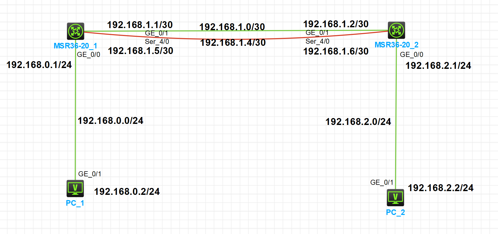

---
html:
    toc: false   # 打开侧边目录
export_on_save:
    html: true  # 自动保存
---

# 静态ECMP

静态ECMP（Equal-CostMultipathRouting）是一种在网络环境中使用的等值多路径路由协议。

在存在多条不同链路到达同一目的地址的情况下，如果使用传统的路由技术，发往该目的地址的数据包只能利用其中的一条链路，其它链路处于备份状态或无效状态，并且在动态路由环境下相互的切换需要一定时间。而静态ECMP可以在该网络环境下同时使用多条链路，不仅增加了传输带宽，并且可以无时延无丢包地备份失效链路的数据传输。

静态ECMP最大的特点是实现了等值情况下，多路径负载均衡和链路备份的目的。



配置完成后，`PC_1` `PC_2` 互相 `ping` 通。


* 配置 `PC_1` `PC_2`

* 配置 `MSR36-20_1` 各个接口IP

```shell
# 进入接口配置模式
[MSR36-20_1] interface g0/0 
# 配置接口 IP 地址
[MSR36-20_1-GigabitEthernet0/0] ip address 192.168.0.1 24
# 退出接口 
[MSR36-20_1-GigabitEthernet0/0] quit
```
```cpp
[MSR36-20_1] interface g0/1
[MSR36-20_1-GigabitEthernet0/1] ip address 192.168.1.1 30
[MSR36-20_1-GigabitEthernet0/1] quit
```
```cpp
[MSR36-20_1] interface s4/0
[MSR36-20_1-Serial4/0] ip address 192.168.1.5 30
[MSR36-20_1-Serial4/0] quit
```

* 配置 `MSR36-20_1` 静态路由

```shell
# 进入静态路由配置模式
# 目的网段：192.168.2.0/24，下一跳：192.168.1.2
[MSR36-20_1] ip route-static 192.168.2.0 24 192.168.1.2
[MSR36-20_1] ip route-static 192.168.2.0 24 192.168.1.6
```


<details><summary> 配置 MSR36-20_2 各个接口 IP</summary>

```shell
[MSR36-20_2] interface g0/0
[MSR36-20_2-GigabitEthernet0/0] ip address 192.168.2.1 24
[MSR36-20_2-GigabitEthernet0/0] quit
```
```shell
[MSR36-20_2] interface g0/1
[MSR36-20_2-GigabitEthernet0/1] ip address 192.168.1.2 30
[MSR36-20_2-GigabitEthernet0/1] quit
```
```shell
[MSR36-20_2] interface s4/0
[MSR36-20_2-Serial4/0] ip address 192.168.1.6 30
[MSR36-20_2-Serial4/0] quit
```
</details>

<details><summary> 配置 MSR36-20_2 静态路由</summary>

```shell
[MSR36-20_2] ip route-static 192.168.0.0 24 192.168.1.1
[MSR36-20_2] ip route-static 192.168.0.0 24 192.168.1.5
```

</details>

# 浮动路由