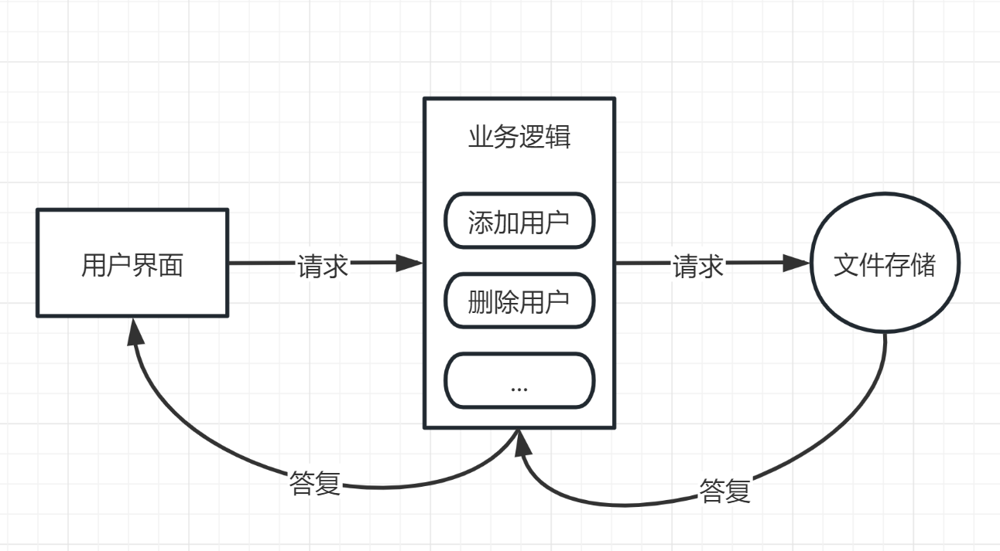

---
html:
    toc: true   # 打开侧边目录
export_on_save:
    html: true  # 自动保存
---

架构为道，模式为术。

设计模式是确定架构下的最佳实践。

推荐阅读：[技术架构涵盖内容和演变过程总结](https://mp.weixin.qq.com/s/Ks26YGFk2pFqizKrzuqJRQ)

 

---

# 单体架构

我们以最喜闻乐见的《xx管理系统》为例，来介绍单体架构，首先明确一下单体架构的特点：

* 一个应用程序包含：**用户界面**、**业务逻辑**、**文件存储**；
* 一个应用程序部署在一个应用服务器上；

> 例：
> 我在管理系统中添加了一个用户，那么我就会在 **用户界面** 中点击添加用户按钮，**用户界面** 就会发送一个请求给 **业务逻辑**，**业务逻辑** 就会解析出添加用户的参数（姓名，年龄，性别），然后请求 **文件存储**（`openfile write`），**业务逻辑** 获取插入结果，再将结果交给 **用户界面** 展示。

很容易发现，单体架构的缺点：

* 一个应用程序包含了所有的功能，所以应用程序会变得越来越大；
* 一个应用程序部署在一个应用服务器上，所以应用程序的并发能力有限；

 

---

# 三层架构

分层架构是将应用程序划分为不同的逻辑层，每个层次都建立在前一层的基础上：

* 每一层都有自己的职责和任务；
* 每一层都可以独立开发和测试；
* 每一层都可以被替换。

三层：

* **用户界面层**（Presentation Layer）：负责向用户显示信息和解释用户命令（将用户的命令转换为对应用程序的请求）；
* **业务逻辑层**（Business Logic Layer）：负责处理应用程序的业务逻辑；
* **数据访问层**（Data Access Layer）：负责访问数据库或者文件系统等等。

> 例：
> 我在管理系统中添加了一个用户，那么我就会在 **用户界面层** 中点击添加用户按钮。
> **注意！** 此时的 **用户界面层** 是一个单独的程序，可以是浏览器、安卓应用、苹果应用、电脑应用。
> **用户界面层** 中不同的软件，对于同一个操作，将会发出同一种请求到 **业务逻辑层**。

> **业务逻辑层** 就会解析出添加用户的参数（姓名，年龄，性别），然后请求 **数据访问层**。

> 如果 **数据访问层** 的服务是由 MySQL 提供的，那么 **数据访问层** 就会将请求转换为 `insert into users (name, age)`，然后请求 MySQL。 
 
> **数据访问层** 获取请求结果，再将结果交给 **业务逻辑层**，**业务逻辑层** 获取插入结果，再将结果交给 **用户界面层** 展示。

 

---

# SOA

领域驱动设计（DDD），它强调软件开发应该以业务需求为核心，而不是以技术为核心。

 

---

# 微服务架构

 

---

# 事件驱动架构

 

---